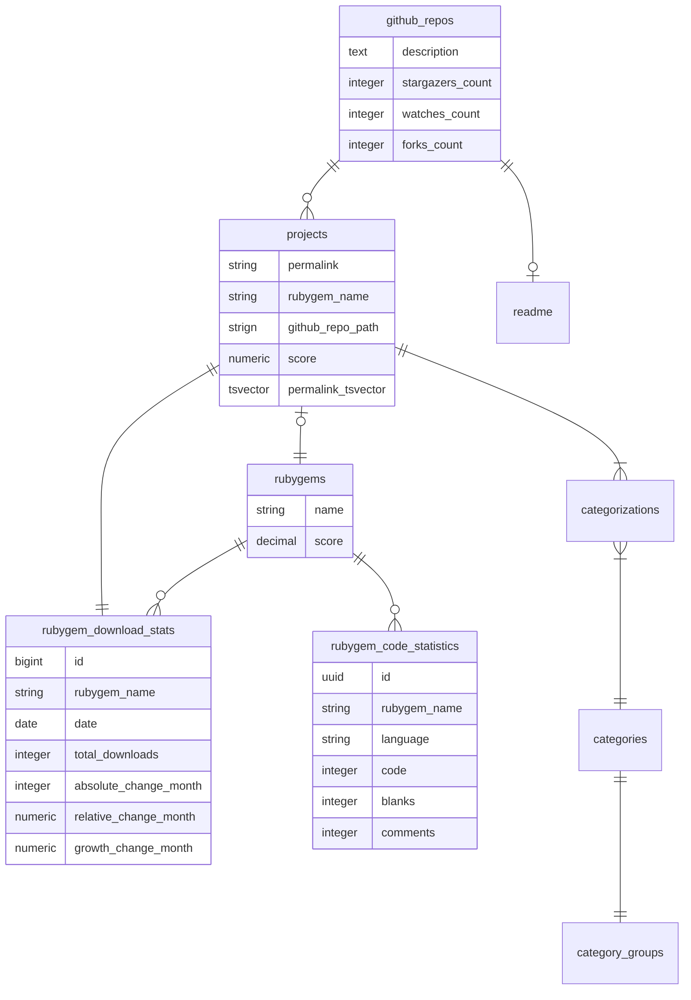

## データ取得フロー

`Cron`: 複数のジョブを実行している。トリガー場所はわからないがインフラレイヤーで1時間毎に設定してそう

- 0時に実行：`RubygemsSyncJob`
  - "rubygems"を使って、DBとRubyGemのホスティング先の差分のGemに対して、`RubygemUpdateJob`を実行
- 4時間毎：`Database::StoreSelectiveExportJob`
  - データベースのエクスポート情報を保持する
- `RubygemDownloadsPersistenceJob`
  - ダウンロード数のデイリーの履歴を作成する（`rubygems.downdloads`から`rubygems_download_stats`をINSERT）
- `RemoteUpdateSchedulerJob`
  - 24時間以上経過している、RubygemやGithubRepoを更新する。24等分してそう
- `CatalogImportJob`
  - API経由でカタログ情報（カテゴリ情報の階層化されたJSON）を取得して保存する
  - `CategoryRankingJob`を実行してカテゴリごとにプロジェクトのスコアでランキングを作成する

`RubygemUpdateJob`: Rubygem情報を更新する

- rubygemsのapiからgem情報（バージョン情報、ダウンロード情報、依存関係）を取得して`rubygems`関連のレコードを更新
- 情報がなければ、`rubygems`レコードを削除
- RubyGemに紐づく`ProjectUpdateJob`を実行
- 現在のバージョンが変わった場合、`RubygemCodeStatsJob`に変更

`GithubRepoUpdateJob`: GitHubRepo情報を更新する

- 無視するリポジトリの場合はスルー （GithubIgnore）
- GraphQLでRepository情報を取得（RepositoryDataQuery）
- 情報があれば、Repository情報を`github_repos`に保存する。また、READMEも取得して`github_readmes`に保存する
- 情報がなければ、`github_repos`を削除する
- GitHubRepoに紐づく`ProjectUpdateJob`を実行

`ProjectUpdateJob`: Project情報を更新する

- rubygemとgithub_repoと紐付ける
- `ProjectScoreJob`でプロジェクトのスコアを計算する
  - スコア計算は、`[rubygemのスコア, リポジトリスコア].compact.yield_self { _1.sum / _1.size }`
  - rubygemのスコアは、`(ダウンロード数 / 最大ダウンロード数) * 100`
  - リポジトリスコアは、`(スター数 + フォーク数x5 / 最大スター数 + 最大フォーク数*5) * 100`
- `ProjectSearchIndexJob`で検索ドキュメントをインデックスをする

## ER図

